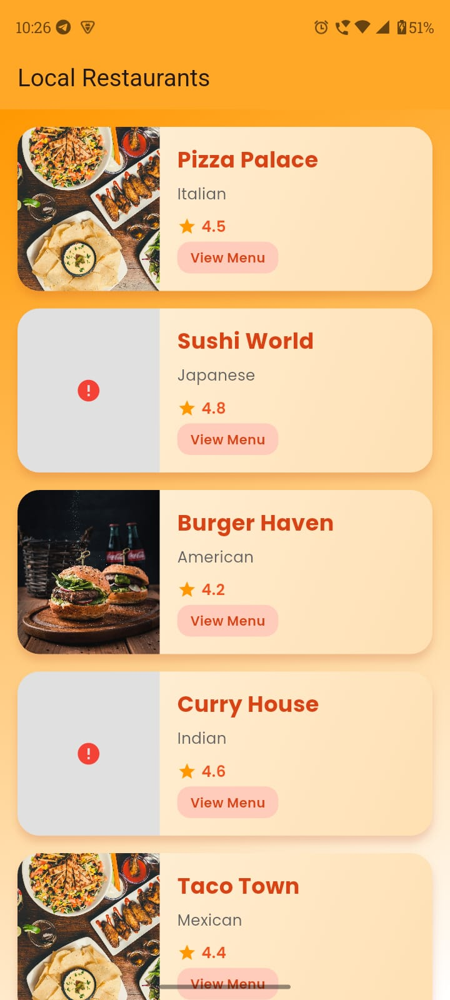
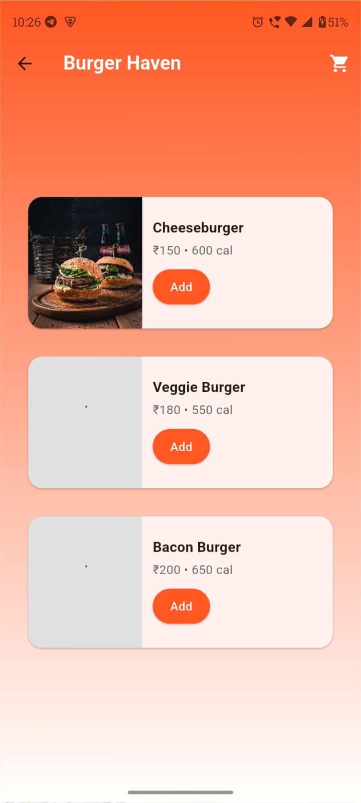
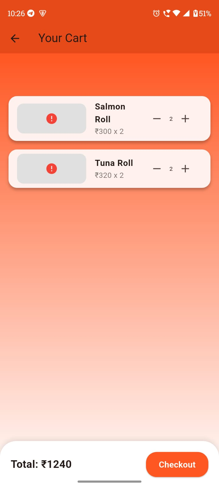

# 🍔 Food App

A Flutter application for browsing restaurants, viewing menus, adding items to cart, and placing orders.  
Built with **BLoC architecture** for state management and follows clean architecture principles.

---

## 📱 Demo App

<table>
  <tr>
    <td></td>
    <td></td>
    <td></td>
  </tr>
  <tr>
    <td align="center"> Home</td>
    <td align="center"> Menu</td>
    <td align="center">Cart</td>
  </tr>
</table>

---

## 🧪 Testing Workflow

This app uses **BLoC architecture**. The test structure is organized by layer:

| Layer       | What’s tested                                                     | Example test case                                                                 |
|-------------|-------------------------------------------------------------------|------------------------------------------------------------------------------------|
| Bloc        | States emitted correctly given certain events                    | `RestaurantBloc`: on `FetchRestaurantsEvent` → emits `Loading`, then `Loaded`     |
| Repository  | Data returns list of restaurants / menus, handles errors         | `RestaurantRepository.getRestaurantList()` returns valid list; errors are caught  |
| UI / Widget | UI responds to bloc states                                       | Loading shows progress, loaded shows list, error shows error message              |
| Integration | Full flow: select restaurant → view menu → add to cart → checkout | Navigating through app updates UI and BLoC states accordingly                     |

---

## 📝 Example Unit Tests

### Bloc Test
```dart
import 'package:flutter_test/flutter_test.dart';
import 'package:bloc_test/bloc_test.dart';
import 'package:food_app/bloc/restaurant_bloc.dart';

void main() {
  group('RestaurantBloc Test', () {
    blocTest<RestaurantBloc, RestaurantState>(
      'emits [Loading, Loaded] when FetchRestaurantsEvent is added',
      build: () => RestaurantBloc(),
      act: (bloc) => bloc.add(FetchRestaurantsEvent()),
      expect: () => [
        RestaurantLoading(),
        isA<RestaurantLoaded>(),
      ],
    );
  });
}
